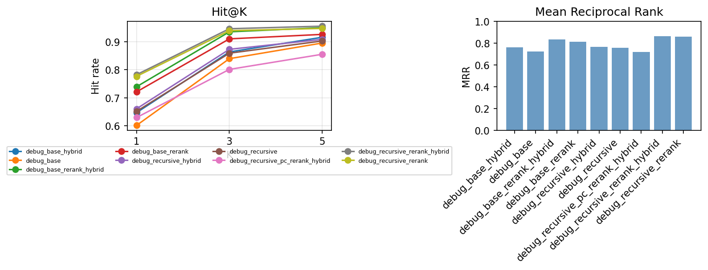
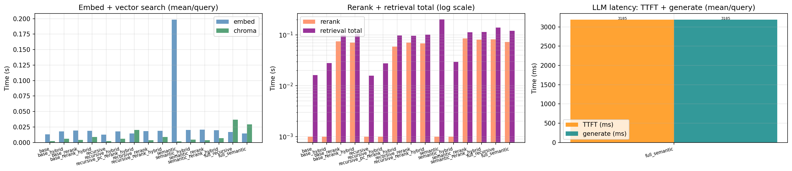
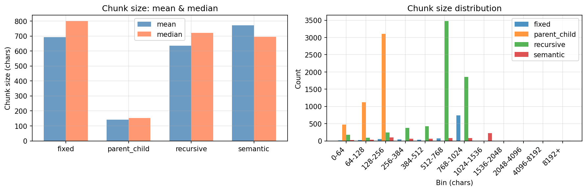

# RAG Experiment Report

Generated: 2026-03-14 08:45 | Baseline: `fixed_rerank_hybrid` | Results: `results/`

---

## Retrieval Metrics (Hit@K & MRR)

| Experiment | Hit@1 | Hit@3 | Hit@5 | MRR | ΔHit@1 | ΔHit@3 | ΔHit@5 | ΔMRR |
| --- | --- | --- | --- | --- | --- | --- | --- | --- |
| debug_base | 60.18% | 83.96% | 89.53% | 72.31% | — | — | — | — |
| debug_base_hybrid | 64.73% | 86.35% | 91.58% | 76.00% | — | — | — | — |
| debug_base_rerank | 72.13% | 91.01% | 92.61% | 81.30% | — | — | — | — |
| debug_base_rerank_hybrid | 73.95% | 93.52% | 94.99% | 83.49% | — | — | — | — |
| debug_recursive | 65.18% | 85.91% | 90.26% | 75.71% | — | — | — | — |
| debug_recursive_hybrid | 66.09% | 87.29% | 90.84% | 76.64% | — | — | — | — |
| debug_recursive_pc_rerank_hybrid | 62.98% | 80.14% | 85.53% | 71.83% | — | — | — | — |
| debug_recursive_rerank | 77.66% | 93.93% | 94.73% | 85.65% | — | — | — | — |
| debug_recursive_rerank_hybrid | 78.24% | 94.62% | 95.53% | 86.28% | — | — | — | — |
| debug_semantic | 76.78% | 88.31% | 91.36% | 82.65% | — | — | — | — |
| debug_semantic_hybrid | 78.31% | 89.49% | 92.54% | 84.23% | — | — | — | — |
| debug_semantic_rerank | 85.25% | 93.05% | 94.24% | 89.12% | — | — | — | — |
| debug_semantic_rerank_hybrid | 85.93% | 93.73% | 94.41% | 89.69% | — | — | — | — |

## Retrieval Latency (mean per query)

| Experiment | Embed | ChromaDB | Rerank | Total | ΔTotal |
| --- | --- | --- | --- | --- | --- |
| debug_base | 12.9 ms | 2.3 ms | 0.0 ms | 16.3 ms | +16.3 ms |
| debug_base_hybrid | 18.0 ms | 6.1 ms | 0.0 ms | 28.1 ms | +28.1 ms |
| debug_base_rerank | 19.1 ms | 4.1 ms | 74.3 ms | 100.1 ms | +100.1 ms |
| debug_base_rerank_hybrid | 18.8 ms | 8.6 ms | 70.9 ms | 103.8 ms | +103.8 ms |
| debug_recursive | 12.7 ms | 2.1 ms | 0.0 ms | 15.8 ms | +15.8 ms |
| debug_recursive_hybrid | 17.9 ms | 5.9 ms | 0.0 ms | 27.6 ms | +27.6 ms |
| debug_recursive_pc_rerank_hybrid | 14.3 ms | 20.0 ms | 58.6 ms | 97.9 ms | +97.9 ms |
| debug_recursive_rerank | 18.3 ms | 3.8 ms | 71.2 ms | 95.8 ms | +95.8 ms |
| debug_recursive_rerank_hybrid | 18.9 ms | 8.7 ms | 68.5 ms | 101.5 ms | +101.5 ms |
| debug_semantic | 198.2 ms | 1.9 ms | 0.0 ms | 201.2 ms | +201.2 ms |
| debug_semantic_hybrid | 20.1 ms | 4.7 ms | 0.0 ms | 29.6 ms | +29.6 ms |
| debug_semantic_rerank | 20.6 ms | 3.7 ms | 85.2 ms | 112.1 ms | +112.1 ms |
| debug_semantic_rerank_hybrid | 19.8 ms | 6.9 ms | 81.4 ms | 114.3 ms | +114.3 ms |

## Answer Quality (RAGAS)

| Experiment | Faithfulness | Answer Relevancy | ΔFaithfulness | ΔAnswer Relevancy |
| --- | --- | --- | --- | --- |
| **fixed_rerank_hybrid** | 96.88% | 77.77% | — | — |
| recursive_rerank_hybrid | 91.02% | 73.83% | -5.86pp | -3.94pp |
| semantic_rerank_hybrid | 94.43% | 62.36% | -2.45pp | -15.41pp |

## Plots

### Retrieval Metrics (Hit@K & MRR)

### Retrieval Latency

### Chunk Size Distribution

